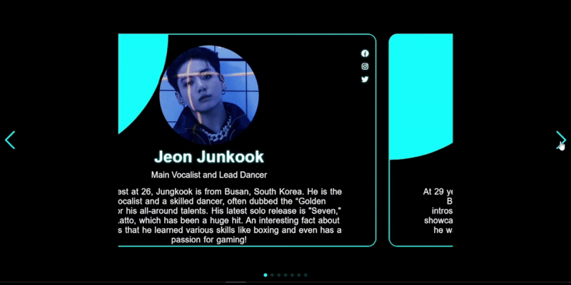

# 🌱 Beginner Web Development Projects

This repository contains a collection of small projects I built while learning the basics of **HTML, CSS, and JavaScript**.  
Each project focuses on a specific concept or feature of web development, and together they reflect my hands-on practice as a beginner.  

---

## 📌 Projects

### 1. 🖱️ Custom Cursor
A creative project where the default mouse pointer is replaced with a **custom-designed cursor**.  
The cursor style changes dynamically as you move across the page, giving the site a modern and interactive feel.  
This project helped me explore **CSS styling, mouse events, and user interface customization**.

**Screenshot**  

---

### 2. ❓ Question Button
A playful project with a button that can never be clicked.  
Whenever the user tries to click it, the button **immediately changes its position and jumps to another spot on the screen**.  
This way, it always runs away and can never be pressed — a fun practice in **event handling, positioning, and dynamic CSS changes**.

**Screenshot**  

---

### 3. ⛅ Simple Weather App
A weather checking app where the user can enter a Location and get current weather details.  
It uses an external **API call** to fetch live weather data and displays temperature and conditions on the screen.  
This project gave me an introduction to **APIs, JSON responses, and asynchronous JavaScript (fetch)**.
🔗 [Live Demo - ](https://weatherapp-4ozw.onrender.com/)

**Screenshot**  

---

### 4. 🖼️ Image Slider
An image slideshow that lets you view multiple images one after another.  
It uses JavaScript to **switch images dynamically**, and CSS for styling and transitions.  
This project was helpful to understand **DOM manipulation and working with multiple images**.

**Screenshot**  

---

### 5. 🎨 Background Color Changer
A small app that changes the background color of the page when you click a button.  
It’s a simple way to practice **DOM updates, CSS manipulation, and JavaScript functions**.
🔗 [Live Demo - ](https://adorable-kelpie-6998c6.netlify.app/)

**Screenshot**  

---

### 6. 😀 Random Emoji Generator
A fun project that shows a random emoji.  
- On **mobile/phone**, a new emoji is generated when you **tap/click the generate button**.  
- On **laptop/desktop**, a new emoji is generated when you **hover over the emoji**.  
This way, the same project behaves differently depending on the device, which helped me practice **event handling for different user interactions**.
🔗 [Live Demo - ](https://adorable-kelpie-6998c6.netlify.app/)

**Screenshot**  

---

### 7. 🖼️ Multiple Image Hovering
A project that displays multiple images, and when you hover over one, it highlights or changes appearance while dimming the others.  
This creates a **gallery-like effect**, making it easier to focus on the image being hovered.  
It was useful for learning **hover effects, CSS transitions, and image manipulation with JavaScript**.

**Screenshot**  

---

### 8. 🎨 Color Picker
A project that allows users to pick colors and see their effect instantly.  
It demonstrates how to work with **input elements, color values, and dynamic styling** in JavaScript.

**Screenshot**  

---

### 9. ⏱️ Stopwatch
A digital stopwatch with **start, pause, and reset** functionality.  
It uses JavaScript’s **setInterval and clearInterval** methods to track time and update the display.  
This project helped me practice **timers and event handling**.
🔗 [Live Demo - ](https://joyful-kheer-efef56.netlify.app/)

**Screenshot**  

---

### 10. 📝 Quote Generator  
A small app that displays random quotes.  
It fetches quotes from an **API** and shows them dynamically when the user clicks next button.  
This project helped me practice working with **APIs, DOM manipulation, and event handling**.  
🔗 [Live Demo - ](https://glittery-biscotti-062546.netlify.app/))

**Screenshot**

---

### 11. 🔐 Password Generator
A simple app that generates random secure passwords.  
It includes options like uppercase, lowercase, numbers, and special characters.  
The user can also set the **strength level (Easy, Medium, Hard)** to control how strong and complex the generated password will be.  
This project improved my understanding of **string manipulation and randomness in JavaScript**.

**Screenshot**  

---

### 12. 📱 QR Code Generator
An app that takes text or a link as input and instantly generates a QR code.  
It uses a **QR code library** to render the code, making it scannable with any mobile device.  
This was a good project to learn about **third-party libraries and dynamic DOM updates**.
🔗 [Live Demo - ](https://qr-code-geenerator007.netlify.app/)

**Screenshot**  

---

### 13. 🔑 Login Page
A simple and clean login page design with input fields for username and password.  
It focuses on creating a good **UI layout with HTML and CSS**, and can be extended with JavaScript validation.  
This project helped me practice **form design, input handling, and user authentication basics**.

**Screenshot**  

---

## 🎯 Purpose of This Repo
The goal of this repository is to track my progress while learning front-end development.  
Each project may look small on its own, but together they represent the key concepts of web development that I have learned step by step. 
